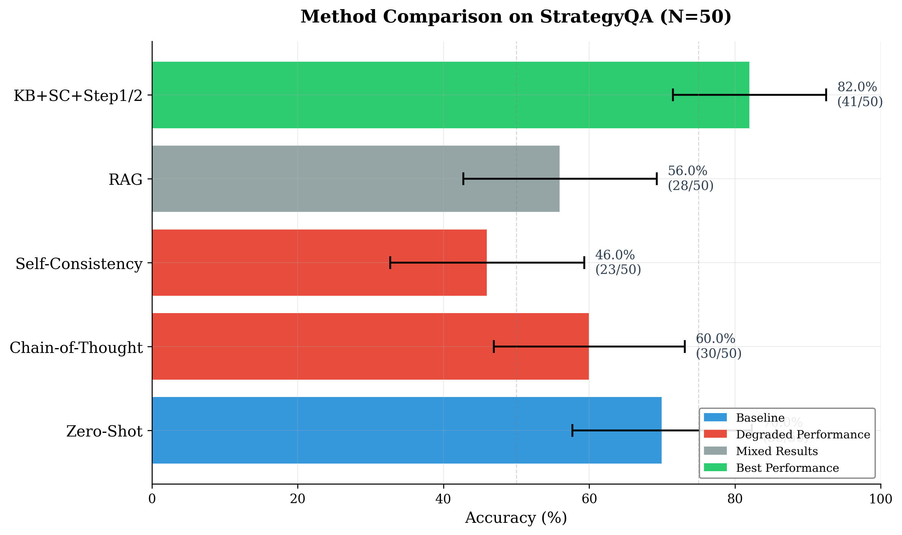

# Knowledge-Augmented Reasoning: Why Naive RAG Fails and Structured Prompting Succeeds



## Overview

This repository contains the code and experiments for our empirical study comparing five knowledge injection strategies for Large Language Model reasoning. We find that naive RAG (placing knowledge base facts in context without structure) hurts performance by 14 percentage points, while our proposed KB+SC+Step1/2 method improves over zero-shot by 12 points.

## Key Findings

| Method | Accuracy | vs Zero-Shot | Key Finding |
|--------|----------|--------------|-------------|
| **KB+SC+Step1/2** | **82.0%** | **+12.0pp** | Only method to improve |
| Zero-Shot | 70.0% | -- | Baseline |
| Chain-of-Thought | 60.0% | -10.0pp | Causes non-committal answers |
| RAG | 56.0% | -14.0pp | Naive KB injection hurts |
| Self-Consistency | 46.0% | -24.0pp | Can't fix KB gaps |

## Architecture


### KB+SC+Step1/2 Pipeline

1. **Knowledge Retrieval**: Retrieve relevant facts from curated knowledge base
2. **Step 1 - Relevance Check**: Does any fact directly relate to the question?
3. **Step 2 - Answer Generation**: Generate answer based on KB facts
4. **Self-Consistency**: Run 5 samples with majority voting
5. **Final Answer**: Majority vote result


## Project Structure

```
self_reflection/
├── src/                          # Core library
│   ├── generator/                # LLM API clients (MiMo, NVIDIA NIM)
│   │   ├── mimo_client.py       # MiMo API client
│   │   ├── nim_client.py        # NVIDIA NIM client
│   │   ├── prompts.py           # Prompt templates
│   │   └── types.py             # Shared data types
│   ├── evaluator/               # PRM evaluator and scoring
│   ├── orchestration/           # Pipeline implementations
│   │   ├── base.py              # BasePipeline ABC
│   │   ├── baseline.py          # Zero-shot baseline
│   │   ├── self_reflection_pipeline.py
│   │   └── ...                  # Other pipelines
│   ├── rl_controller/           # MCTS, actions, tree structures
│   ├── knowledge/               # Knowledge retrieval
│   │   └── retriever.py         # Pattern-based KB retrieval
│   ├── utils/                   # Shared utilities
│   │   ├── unified_extractor.py # Fair answer extraction
│   │   ├── metrics.py           # Metrics collection
│   │   └── complexity.py        # Query complexity analysis
│   └── exceptions.py            # Custom exceptions
├── scripts/                     # Benchmark runners
│   ├── run_benchmark.py         # Main benchmark runner
│   ├── run_ablation.py          # Ablation study
│   ├── run_cross_validation.py  # k-fold cross-validation
│   ├── aggregate_results.py     # Result aggregation
│   └── generate_figures.py      # Figure generation
├── tests/                       # Test suite (256 tests)
├── paper/                       # LaTeX paper and figures
├── data/datasets/               # Benchmark datasets
├── benchmark_results/           # Benchmark output files
└── report/                      # Detailed PDF report
```

## Installation

```bash
git clone https://github.com/Sathvikar01/self_reflection.git
cd self_reflection
pip install -e ".[dev]"
```

## Usage

### Running Benchmarks

```bash
# Quick test (no API needed)
python scripts/run_benchmark.py --mock --num-questions 5

# Full benchmark with MiMo API
python scripts/run_benchmark.py --dataset data/datasets/benchmark_final_v2.json

# Ablation study
python scripts/run_ablation.py --dataset data/datasets/benchmark_final_v2.json

# Cross-validation
python scripts/run_cross_validation.py --dataset data/datasets/benchmark_final_v2.json --folds 5
```

### Configuration

Set your API key in `.env`:
```
MIMO_API_KEY=your_key_here
MIMO_BASE_URL=https://token-plan-sgp.xiaomimimo.com/v1
MIMO_MODEL=mimo-v2.5-pro
```

### Running Tests

```bash
pytest tests/ -v
```

## Statistical Analysis

All comparisons use McNemar's test for paired binary outcomes with continuity correction. Confidence intervals use the Wilson score method.

| Comparison | χ² | p-value | Significant |
|------------|-----|---------|-------------|
| KB+SC+Step1/2 vs SC | 14.45 | 0.0001 | Yes |
| KB+SC+Step1/2 vs RAG | 9.60 | 0.0019 | Yes |
| KB+SC+Step1/2 vs CoT | 7.69 | 0.0055 | Yes |
| Zero-Shot vs SC | 7.56 | 0.0060 | Yes |

## Citation

```bibtex
@inproceedings{r2026knowledge,
  title={Why Naive RAG Fails: An Empirical Study of Knowledge Injection Strategies for Large Language Model Reasoning},
  author={Sathvik A R},
  year={2026},
  institution={PES University}
}
```

## License

MIT License

## Author

Sathvik A R - PES University - arsathvik48@gmail.com
